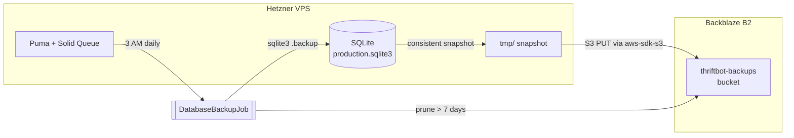
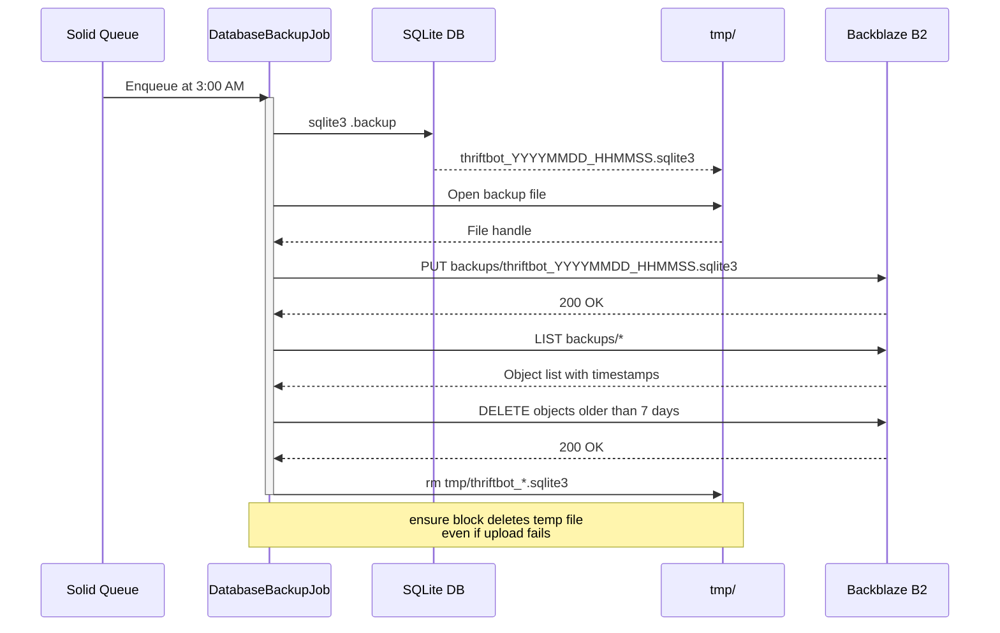
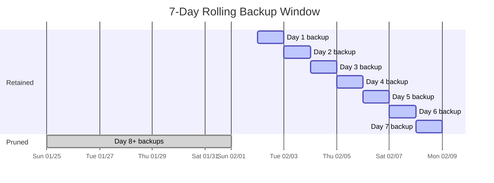
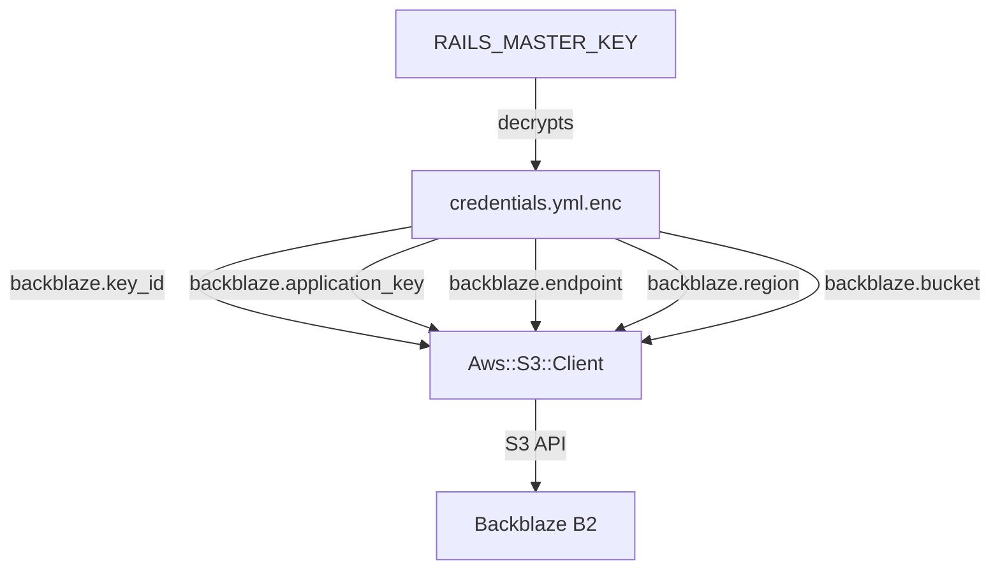

# Database Backups

Thriftbot uses automated daily backups of its SQLite production database to [Backblaze B2](https://www.backblaze.com/cloud-storage) cloud storage. Backups run on the existing Solid Queue infrastructure with zero additional monthly cost (B2 free tier: 10 GB).

---

## Architecture Overview



## Backup Lifecycle



## Retention Policy



- **Schedule:** Every day at 3:00 AM (server time)
- **Retention:** 7 days (configurable via `DatabaseBackupJob::RETENTION_DAYS`)
- **Restore points:** Up to 7 at any given time
- **Pruning:** Old backups are deleted automatically after each new backup uploads

---

## How It Works

### 1. Consistent Snapshot

The job uses SQLite's built-in `.backup` command, which creates an atomic, consistent copy of the database — safe to run while the app is reading and writing:

```ruby
system("sqlite3", db_path.to_s, ".backup '#{backup_path}'", exception: true)
```

This is **not** a file copy. SQLite's backup API handles WAL checkpointing and page-level locking internally, guaranteeing a valid database file.

### 2. Upload to Backblaze B2

The snapshot is uploaded to B2 using the S3-compatible API (`aws-sdk-s3` gem). The gem is lazy-loaded (`require: false` in Gemfile, `require "aws-sdk-s3"` inside `perform`) so it only occupies memory when the job actually runs.

```
Bucket:  thriftbot-backups
Key:     backups/thriftbot_20260209_030000.sqlite3
```

### 3. Prune Old Backups

After uploading, the job lists all objects in the `backups/` prefix and deletes any older than 7 days via a single batch `DELETE` call.

### 4. Cleanup

An `ensure` block guarantees the local temp file is removed regardless of success or failure.

### 5. Error Handling

Transient S3 errors trigger automatic retries:

```ruby
retry_on Aws::S3::Errors::ServiceError, wait: :polynomially_longer, attempts: 3
```

This gives 3 attempts with increasing wait times (3s, 18s, 83s) before the job is discarded.

---

## File Map

| File | Purpose |
|------|---------|
| `app/jobs/database_backup_job.rb` | The backup job: snapshot, upload, prune |
| `config/recurring.yml` | Solid Queue schedule (daily at 3 AM) |
| `lib/tasks/backup.rake` | Rake tasks for manual operations |
| `config/deploy.yml` | Kamal `backup` alias |
| `test/jobs/database_backup_job_test.rb` | Job tests |

---

## Credentials

Stored in Rails encrypted credentials (`config/credentials.yml.enc`), decrypted at runtime by `RAILS_MASTER_KEY`:

```yaml
backblaze:
  key_id: "..."          # B2 application key ID (scoped to bucket)
  application_key: "..." # B2 application key secret
  bucket: "thriftbot-backups"
  endpoint: "https://s3.us-west-004.backblazeb2.com"
  region: "us-west-004"
```

The application key is scoped to the `thriftbot-backups` bucket only, with these capabilities: `deleteFiles`, `listBuckets`, `listFiles`, `readBuckets`, `readFiles`, `writeFiles`.

No additional Kamal secrets are needed — everything flows through the existing `RAILS_MASTER_KEY`.



---

## Usage

### Automatic (production)

Runs automatically via Solid Queue. No action needed after deployment.

Check the Solid Queue dashboard or Rails logs for:
```
Database backup completed: thriftbot_20260209_030000.sqlite3
```

### Manual Backup

**Local:**
```bash
bin/rails db:backup
```

**Production (via Kamal):**
```bash
bin/kamal backup
```

### List Backups

**Local:**
```bash
bin/rails db:backup_list
```

**Production:**
```bash
bin/kamal app exec "bin/rails db:backup_list"
```

Example output:
```
Available backups:
----------------------------------------------------------------------
Filename                                         Size Date
----------------------------------------------------------------------
thriftbot_20260209_030000.sqlite3              2.28 MB 2026-02-09 03:00:00 UTC
thriftbot_20260208_030000.sqlite3              2.25 MB 2026-02-08 03:00:00 UTC
----------------------------------------------------------------------
Total: 2 backup(s)
```

### Restore from Backup

**1. Download the backup:**
```bash
bin/rails db:restore[thriftbot_20260209_030000.sqlite3]
```

**2. Stop the app, swap the database, restart:**
```bash
bin/kamal app stop
# Copy the downloaded file into the storage volume
bin/kamal app exec "cp tmp/thriftbot_20260209_030000.sqlite3 storage/production.sqlite3"
bin/kamal app start
```

---

## Monitoring

### Verify backups are running

```bash
# Check the latest backup in B2
bin/kamal app exec "bin/rails db:backup_list"

# Check Solid Queue logs for the job
bin/kamal logs | grep "Database backup"
```

### What to look for

| Signal | Meaning |
|--------|---------|
| `Database backup completed: thriftbot_*.sqlite3` | Backup succeeded |
| `Uploaded ... to B2 (N bytes)` | Upload confirmed with file size |
| `Pruned N backup(s) older than 7 days` | Old backups cleaned up |
| `Aws::S3::Errors::ServiceError` in logs | Upload failed (will retry up to 3 times) |

### If backups stop working

1. Check credentials are still valid: `bin/rails credentials:show` (look for `backblaze:` section)
2. Check B2 key hasn't expired: log in to [Backblaze B2 Console](https://secure.backblaze.com/b2_buckets.htm)
3. Check Solid Queue is processing jobs: look at `solid_queue_jobs` table for failed entries
4. Run a manual backup to see the error: `bin/kamal backup`

---

## Cost

| Resource | Cost |
|----------|------|
| Backblaze B2 storage (free tier) | $0.00/mo (up to 10 GB) |
| Solid Queue (runs in Puma process) | $0.00/mo (no extra server) |
| `aws-sdk-s3` gem | Free, open source |
| **Total** | **$0.00/mo** |

At ~2.3 MB per backup and 7-day retention, storage usage is approximately **16 MB** — well within the 10 GB free tier.
